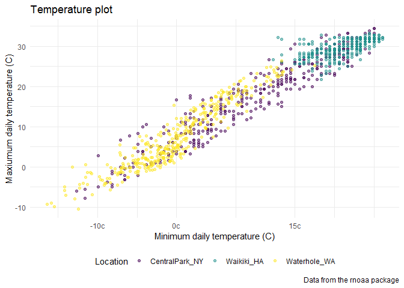

viz_part_01
================
Yujie Huang
2022-09-29

## let’s import data

``` r
library(tidyverse)
```

    ## ── Attaching packages ─────────────────────────────────────── tidyverse 1.3.2 ──
    ## ✔ ggplot2 3.3.6     ✔ purrr   0.3.4
    ## ✔ tibble  3.1.8     ✔ dplyr   1.0.9
    ## ✔ tidyr   1.2.0     ✔ stringr 1.4.1
    ## ✔ readr   2.1.2     ✔ forcats 0.5.2
    ## ── Conflicts ────────────────────────────────────────── tidyverse_conflicts() ──
    ## ✖ dplyr::filter() masks stats::filter()
    ## ✖ dplyr::lag()    masks stats::lag()

``` r
library(ggridges)
```

``` r
weather_df = 
  rnoaa::meteo_pull_monitors(
    c("USW00094728", "USC00519397", "USS0023B17S"),
    var = c("PRCP", "TMIN", "TMAX"), 
    date_min = "2017-01-01",
    date_max = "2017-12-31") %>%
  mutate(
    name = recode(
      id, 
      USW00094728 = "CentralPark_NY", 
      USC00519397 = "Waikiki_HA",
      USS0023B17S = "Waterhole_WA"),
    tmin = tmin / 10,
    tmax = tmax / 10) %>%
  select(name, id, everything())
```

    ## Registered S3 method overwritten by 'hoardr':
    ##   method           from
    ##   print.cache_info httr

    ## using cached file: C:\Users\Owner\AppData\Local/Cache/R/noaa_ghcnd/USW00094728.dly

    ## date created (size, mb): 2022-09-29 10:33:10 (8.418)

    ## file min/max dates: 1869-01-01 / 2022-09-30

    ## using cached file: C:\Users\Owner\AppData\Local/Cache/R/noaa_ghcnd/USC00519397.dly

    ## date created (size, mb): 2022-09-29 10:33:37 (1.703)

    ## file min/max dates: 1965-01-01 / 2020-03-31

    ## using cached file: C:\Users\Owner\AppData\Local/Cache/R/noaa_ghcnd/USS0023B17S.dly

    ## date created (size, mb): 2022-09-29 10:33:50 (0.952)

    ## file min/max dates: 1999-09-01 / 2022-09-30

## scatterplot

``` r
ggplot_weather=
  weather_df %>%  
  ggplot(aes(x = tmin, y = tmax, color=name)) + 
  geom_point(alpha=0.5)+
   labs(
    title = "Temperature plot",
    x = "Minimum daily temperature (C)",
    y = "Maxiumum daily temperature (C)",
    caption = "Data from the rnoaa package"
  )+
  scale_x_continuous(
    breaks= c(-10, 0, 15),
    labels = c("-10c", "0c", "15c")
  ) + 
  viridis::scale_color_viridis(
    name = "Location", 
    discrete = TRUE
  )
```

``` r
ggplot_weather+ 
  theme_minimal() +
  theme(legend.position = "bottom")
```

    ## Warning: Removed 15 rows containing missing values (geom_point).

<!-- -->
